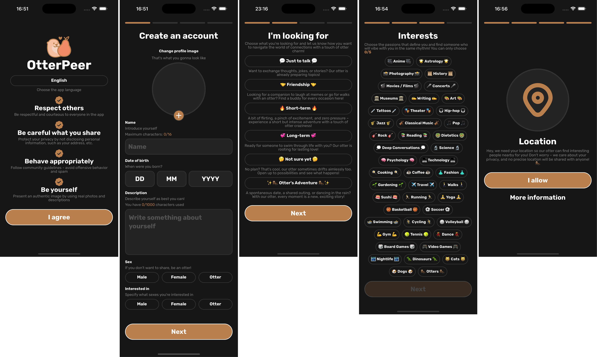
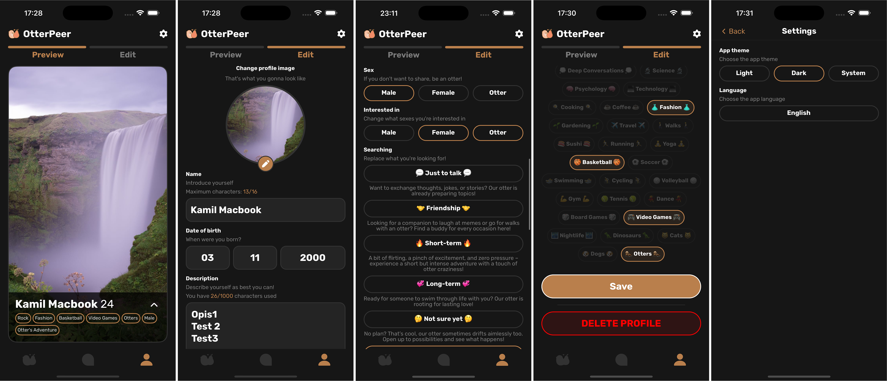

# OtterPeer

OtterPeer is an open-source, proof-of-concept mobile peer-to-peer (P2P) dating application built using [React Native](https://reactnative.dev/) and powered by the [WebRTC protocol](https://webrtc.org/).

## Project Vision

OtterPeer aims to provide a transparent, privacy-focused, and non-profit alternative to mainstream dating applications. Unlike subscription-based, profit-driven apps, OtterPeer prioritizes user privacy and genuine connections, avoiding conflicts of interest. The project addresses growing concerns in the dating app market, including data sales, invasive AI data processing, and significant data breaches, as highlighted by [Mozilla's research](https://www.mozillafoundation.org/en/blog/everything-but-your-mothers-maiden-name-mozilla-research-finds-majority-of-dating-apps-more-data-hungry-and-invasive-than-ever/).

## Status

🚧 **Work in Progress**: OtterPeer is currently under active development as part of a Bachelor thesis by a team of three students, with an expected defense in July 2025. After this milestone, the team plans to publish detailed findings, enhance public documentation, and outline future development plans.

⚠️ **Contributions**: We are not accepting external contributions at this time due to time constraints and the academic nature of the project. Stay tuned for updates post-July 2025!

## Features

OtterPeer currently supports the following features:

- **P2P Communication**: Establishes direct peer-to-peer connections using a bootstrap server as a signaling server, with signaling over WebRTC data channels, inspired by [this research](https://www.sciencedirect.com/science/article/abs/pii/S0140366415002108).
- **User Interface**: Displays user profiles in a swipe-based interface, with filtering and chatting capabilities.
- **End-to-End Encrypted Chats**: Secures messages with 256-bit AES keys stored locally on the device.
- **Peer Verification**: Cryptographically verifies peer identities using RSA key pairs.
- **Distributed Hash Table (DHT)**: Implements a simplified Kademlia DHT for routing and caching chat messages.
- **Local AI Recommendations**: Features a privacy-preserving, on-device recommendation system inspired by [prototypical networks](https://arxiv.org/abs/1703.05175), based on users' swipe history.
- **Peer Exchange (PEX)**: Enables network discovery for P2P connections.
- **DHT-Based Signaling**: Supports signaling over the DHT for enhanced scalability.
- **User Blocking**: Allows users to block others for a safer experience.
- **Geolocation Obfuscation**: Protects user privacy by obfuscating true geolocation data.

## Screenshots

## Tech Stack

- **Framework**: React Native
- **Protocol**: WebRTC for P2P communication
- **Encryption**: 256-bit AES for chats, RSA for peer verification
- **Networking**: Simplified Kademlia DHT for routing and signaling
- **AI**: On-device recommendation system using prototypical networks

## License

OtterPeer is licensed under the [GNU Affero General Public License v3.0 (AGPL-3.0)](https://www.gnu.org/licenses/agpl-3.0.en.html). See the [LICENSE](LICENSE) file for details.

## Contact

For inquiries, please reach out via [GitHub Issues](https://github.com/your-username/otterpeer/issues). Stay tuned for updates as the project progresses!

## Licenses for Assets

Licenses for assets are located in the [`assets/licences`] folder:
- **Font**: Rubik, Copyright 2015 The Rubik Project Authors ([github.com/googlefonts/rubik](https://github.com/googlefonts/rubik)), licensed under the SIL Open Font License 1.1.
- **Icons**: Uicons by [Flaticon](https://www.flaticon.com/uicons), licensed under Free for commercial use WITH ATTRIBUTION.